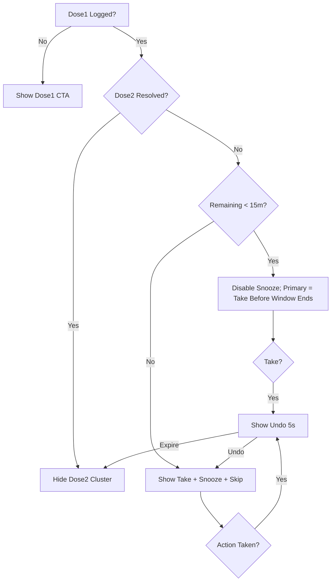

# Button Logic & Function Mapping (XYWAV-Only Night-First)

Authoritative mapping of every actionable control in the simplified Night‑First interface (Tonight, Timeline, Insights, Devices, Settings, watchOS). All prior multi‑med, refill, pharmacy, profile, and generic auth flows removed. Only actions that affect: dose timing, event capture, analytics export, device/permission state.

## 1. Core Dose Actions (Tonight Screen)

Component IDs reference `ui-ux-specifications.md`.

| Button (Label) | Component ID | Preconditions | Action Function | API Call (Payload) | State Transitions | Notes |
|----------------|--------------|--------------|-----------------|-------------------|-------------------|-------|
| Log Dose 1 ("Dose 1 Taken") | btn.dose1.log | No Dose1 event yet; within Dose1 window | `logDose1(timestamp)` | POST /doses/take { type:"dose1", at } | idle → loading → success/error | Default timestamp = now (editable -5/+10m). Starts adaptive planning & clamp timer. Undo (5s) appears on success. |
| Take Dose 2 ("Take Now" / edge label variant) | btn.dose2.take | Dose1 logged; Dose2 pending; now within 150–240m window | `takeDose2(timestamp)` | POST /doses/take { type:"dose2", at } | idle → loading → success/error | Label morphs to "Take Before Window Ends (MM:SS)" when <15m remain; Snooze auto-disabled. Undo (5s) after success. |
| Snooze Dose 2 ("Snooze 10m") | btn.dose2.snooze | Dose2 pending; ≥15m remaining; proposed new target ≤240m | `snoozeDose2(+10m)` | POST /doses/snooze { minutes:10 } | idle → loading → success/error | Disabled when remainingWindow <15m. 422 → window modal. No Undo. |
| Skip Dose 2 ("Skip Dose 2") | btn.dose2.skip | Dose2 pending | `skipDose2(reason?)` | POST /doses/skip { type:"dose2", reason? } | idle → confirm → loading → success/error | Optional reason (<80 chars). Undo (5s) on success. |
| Bathroom ("Bathroom?" / quick log) | btn.bathroom.log | Between Dose1 and Dose2 resolution | `logBathroomEvent()` | POST /events/log { event:"bathroom", at } | tap → flash success | Triggers local recalculation for subtle nudge; no Undo. |
| Export CSV ("Export") | btn.analytics.export | Any time; network available | `exportAnalytics()` | GET /analytics/export | idle → loading → file/save | Dose + derived metrics. |
| Undo ("Undo") | btn.dose.undo | Within 5s after Dose1 log / Dose2 take / Dose2 skip | `undoLastAction()` | (Local rollback + cancel pending) | counting down 5s → revert/expire | Removes optimistic event & cancels unsent request; disabled after timeout or server settle. |

### Snooze & Remaining Window Logic

Snooze disabled when remainingWindowMinutes < 15.

### Pseudocode: Snooze Validation

```swift
func attemptSnooze(now: Date, dose1: Date, proposedMinutes: Int, currentTarget: Date) -> SnoozeResult {
  let newTarget = currentTarget.addingTimeInterval(TimeInterval(proposedMinutes*60))
  let minBoundary = dose1.addingTimeInterval(150*60)
  let maxBoundary = dose1.addingTimeInterval(240*60)
  guard newTarget >= minBoundary && newTarget <= maxBoundary else {
    return .rejected(reason: .windowExceeded)
  }
  return .accepted(newTarget)
}
```

### Near-Window Behaviors & Undo

- When remaining window < 15 minutes, automatically disable Snooze and elevate the primary button label to “Take Before Window Ends (MM:SS)”.
- When remaining window ≤ 00:00, hide Snooze/Take and show a blocking message: “Dose 2 window closed.”
- Provide a 5‑second UNDO snackbar after Take or Skip. If tapped, revert local state and cancel the queued API call (if any).
- Offline semantics: queue Take/Skip/Snooze; show [Queued] chip; auto‑flush on reconnect.

### Error Surfaces

| Error | Trigger | UI Response |
|-------|---------|-------------|
| 422_WINDOW_EXCEEDED | Snooze/take outside 150–240m clamp | Modal: "Window exceeded. Take now or Skip." |
| 409_ALREADY_TAKEN | Duplicate take/skip | Toast: "Dose 2 already resolved" + disable cluster |
| 401_DEVICE_NOT_REGISTERED | Action before device registration | Blocking sheet: prompt to re-open app to finish setup |
| 429_RATE_LIMIT | Rapid repeated taps | Toast: "Too many taps. Try again in a moment." + 2s cooldown |
| 422_SNOOZE_LIMIT | Exceeded nightly snooze cap | Modal: "Snooze limit reached for tonight" |
| 422_DOSE1_REQUIRED | Attempt Dose2 action pre-Dose1 | Toast: "Log Dose 1 first" + focus ring on Dose1 button |
| NETWORK_OFFLINE | Any network action | Inline banner + queue (Take/Skip/Snooze) + retry affordance |

## 2. Timeline Screen Buttons

| Button | ID | Preconditions | Action | Notes |
|--------|----|--------------|--------|-------|
| Scroll to Tonight Anchor | btn.timeline.scrollTonight | Timeline loaded | `scrollToToday()` | Convenience; no API. |
| Filter Bathroom Events | btn.timeline.filterBathroom | Events >0 tonight | `toggleBathroomFilter()` | Locally hides/shows bathroom markers. |
| Filter Notes | btn.timeline.filterNotes | Any notes present | `toggleNoteFilter()` | Locally hides/shows note markers. |

No edit/delete; timeline is immutable record.

## 3. Insights Screen Buttons

| Button | ID | Action | Notes |
|--------|----|--------|-------|
| Export (same as Tonight) | btn.analytics.export | `exportAnalytics()` | Aliased control; identical behavior. |
| Change Interval (7d/30d) | btn.insights.range | `setInsightsRange(days)` | Recomputes aggregates client-side; no new API. |
| Generate Weekly Plan | btn.insights.plan.generate | `runWeeklyPlanner(165,180,195,210,225)` | Client-only; writes 7 rows to local plan with rationale |

## 4. Devices Screen Buttons

| Button | ID | Preconditions | Action | Notes |
|--------|----|--------------|--------|-------|
| Connect HealthKit | btn.devices.hk.connect | Not yet granted | `requestHealthKitAuth()` | On success refresh insights eligibility. |
| Retry Sync | btn.devices.retry | Last sync failed | `retryDeviceSync()` | Uses local queue; no new endpoints. |
| Connect WHOOP (Import History) | btn.devices.whoop.connect | WHOOP not imported | `startWhoopImport()` | One-time backfill; no recurring polling. |
| Pair Flic Button | btn.devices.flic.pair | Flic not paired | `beginFlicPairing()` | Enables hardware single‑press = Dose2 Take; long‑press = Snooze attempt; double‑press = Bathroom log. |

## 5. Settings Screen Buttons

| Button | ID | Action | Notes |
|--------|----|--------|-------|
| Toggle High Contrast | btn.settings.a11y.contrast | `toggleHighContrast()` | Persists flag; triggers palette swap (no server call). |
| Toggle Reduced Motion | btn.settings.a11y.motion | `toggleReducedMotion()` | Prefers simplified transitions. |
| Clear Local Cache | btn.settings.cache.clear | `clearLocalCache()` | Retains dose history; purges derived caches. |
| Export (redundant affordance) | btn.analytics.export | `exportAnalytics()` | Same as other instances. |
| Sign Out | btn.settings.signout | `signOut()` | Local session clear (no multi-user features). |

## 6. watchOS Buttons

| Context | Button | ID | Action | Constraints |
|---------|--------|----|--------|-------------|
| Complication Tap | Open Tonight | watch.entry.tonight | `openTonight()` | Passive. |
| Dose Card | Take Now (press‑and‑hold 1s) | watch.dose2.take | `takeDose2(now)` | Hold-to-confirm; clamp + undo; offline queue. |
| Dose Card | Snooze 10m | watch.dose2.snooze | `snoozeDose2(10)` | Disabled <15m remaining or if would exceed clamp. |
| Dose Card | Skip | watch.dose2.skip | `skipDose2(reason:nil)` | One-tap skip; confirmation haptic. |
| Dose1 Absent | Log Dose1 | watch.dose1.log | `logDose1(now)` | If outside allowable Dose1 window show error toast. |
| Bathroom | Log Bathroom | watch.bathroom.log | `logBathroomEvent()` | Quick event; updates nudge. |

## 7. State Model (Simplified)



Dose2 button cluster disabled when: network offline & no local queue OR already resolved.

## 8. Shared Action Handler Patterns

```swift
func performDose2Take(now: Date) async {
  guard state.dose2.isPending else { return }
  ui.dose2Take.state = .loading
  do {
    try await api.takeDose(type: .dose2, at: now)
    state.resolveDose2(takenAt: now)
    ui.showUndo(for: .dose2Take, duration: 5) { undoDose2Take() }
    ui.dose2Take.state = .success
  } catch APIError.windowExceeded {
    ui.presentWindowExceededModal()
    ui.dose2Take.state = .idle
  } catch APIError.deviceNotRegistered {
    ui.presentDeviceRegistrationSheet()
    ui.dose2Take.state = .idle
  } catch APIError.rateLimited {
    ui.toast("Too many taps. Try again")
    ui.cooldownDose2Cluster(seconds: 2)
    ui.dose2Take.state = .idle
  } catch {
    ui.dose2Take.state = .error
  }
}

func undoDose2Take() {
  state.revertDose2()
  api.cancelPending(.dose2Take)
}
```

## 9. Testing Matrix (Focused)

| Button | Test Cases | Priority | Expected |
|--------|------------|----------|----------|
| Log Dose1 | Normal, Backdated -5m, Future +10m reject | HIGH | Creates event or validation error |
| Take Dose2 | At target, 150m, 239m, 240m, >240m (reject) | HIGH | Success or 422 modal |
| Snooze Dose2 | Valid, Exactly reaches 240m, Would exceed 240m (422), RemainingWindow <15m (disabled) | HIGH | Accept / modal / disabled |
| Skip Dose2 | Confirm, Cancel, Undo within 5s | HIGH | Event or canceled; undo reverts |
| Bathroom Log | Single, Rapid 3x, Double-press Flic | MEDIUM | All events logged |
| Export | With data, Empty dataset | MEDIUM | File download present |
| Near Window Edge | At 239m: Snooze disabled; 240m: window closed state | HIGH | Correct labels/states |
| Undo | Take then Undo; Skip then Undo; Expire path | HIGH | Reversion vs persistence |
| Offline Queue | Take offline then reconnect | HIGH | Event flushes with correct timestamp |
| DST/Timezone Shift | Night crossing DST; timezone travel mid-window | MEDIUM | Elapsed minutes preserved |
| Deep Link Events | dose1/dose2/bathroom/lights_out/wake_final | MEDIUM | Correct event & validation |
| Rate Limit | Rapid taps until 429 | LOW | Toast + cooldown |

## 10. Analytics Event Names

| Action | Event Name | Properties |
|--------|------------|------------|
| Log Dose1 | dose1_taken | { at, deviationFromPlanMins } |
| Take Dose2 | dose2_taken | { at, planTarget, varianceMins, remainingWindowMinsAtTake } |
| Snooze Dose2 | dose2_snoozed | { from, to, deltaMins, remainingWindowMins } |
| Skip Dose2 | dose2_skipped | { reason?, at, remainingWindowMins } |
| Undo (any) | undo_performed | { revertedEventType, originalAt } |
| Bathroom | bathroom_event_logged | { at, countTonight } |
| Weekly Plan Generated | planner_week_generated | { intervals:[..], rationaleVersion, period:"YYYY-WW" } |
| Deep Link Invoked | deeplink_invoked | { event: one of (dose1, dose2, bathroom, lights_out, wake_final) } |
| Export | analytics_exported | { rangeDays, recordCount } |

Privacy Note: All analytics events are processed locally; no personal identifiers or physiological metrics transmitted. If optional minimal sync (future) is enabled, only de‑identified timing metadata (event type + UTC + offset + random device id) may be uploaded—never raw HR, RR, or sleep stage data.

## 11. Error Handling Mapping

| Error Code | Buttons Affected | UX Pattern | Retry Strategy |
|------------|------------------|-----------|----------------|
| 422_WINDOW_EXCEEDED | Snooze, Take | Modal with guidance | None |
| 409_ALREADY_TAKEN | Take, Snooze, Skip | Toast + disable cluster | None |
| 401_DEVICE_NOT_REGISTERED | All dose actions | Blocking sheet; reopen app | Retry after registration |
| 429_RATE_LIMIT | Any dose action | Toast + 2s cooldown | Auto-enable cluster |
| 422_SNOOZE_LIMIT | Snooze | Modal; focus Take | None |
| 422_DOSE1_REQUIRED | Dose2 actions | Toast highlight Dose1 | User logs Dose1 |
| 500_SERVER | Take/Snooze/Skip | Toast + one automatic retry (take/snooze) | One retry then idle |
| OFFLINE | Take/Skip/Snooze | Banner + queue + badge | Flush on reconnect |

## 12. Accessibility & Contrast

All buttons meet 4.5:1 in normal mode; high-contrast toggle elevates Dose2 cluster ≥7:1 and adds 2px accent focus ring. Reduced Motion swaps animations for static labels. Dynamic Type up to XXL; ≥48pt hit targets.

VoiceOver:

- At −5m: "Dose 2 window closes in five minutes"
- At window end (240m): "Dose 2 window ended"
- Countdown (<15m) updates every 30s (polite)

Hold-to-confirm (watchOS take) accessibilityHint: "Press and hold one second to take Dose 2".

## 13. Deep Links

Format: `dosetap://log?event={dose1|dose2|bathroom|lights_out|wake_final}&at={ISO8601?}` (at optional; defaults now)

| Event | Action | Validation |
|-------|--------|------------|
| dose1 | Log Dose1 | Window check (reject toast if invalid) |
| dose2 | Take Dose2 | Clamp check (422 modal on violation) |
| bathroom | Log Bathroom | Ignored if Dose2 resolved |
| lights_out | Log Lights Out marker | Always allowed |
| wake_final | Log Final Wake marker | Always allowed |

## Acceptance Criteria Summary

1. Only actions & deep links enumerated appear (no legacy med management labels).
2. Snooze disabled <15m remaining; attempts outside window produce 422 modal; never mutates state.
3. Undo available 5s after Dose1, Dose2 take, Dose2 skip and fully reverts optimistic state.
4. Weekly planner generation is client-only and never calls new endpoints.
5. Flic mappings: single=Take, long=Snooze, double=Bathroom enforced consistently.
6. Export behavior identical across Tonight, Insights, Settings.
7. watchOS Take requires 1s hold and supports Undo.
8. VoiceOver announces window edge events (−5m & end) and countdown (<15m every 30s) politely.
9. All listed error codes surface specified UX patterns verbatim.
10. Deep link events map to documented endpoints with identical validation.
